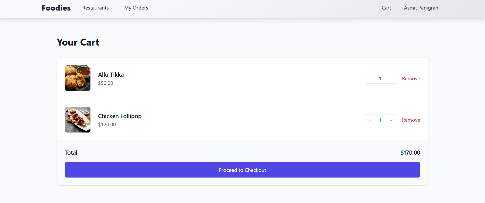
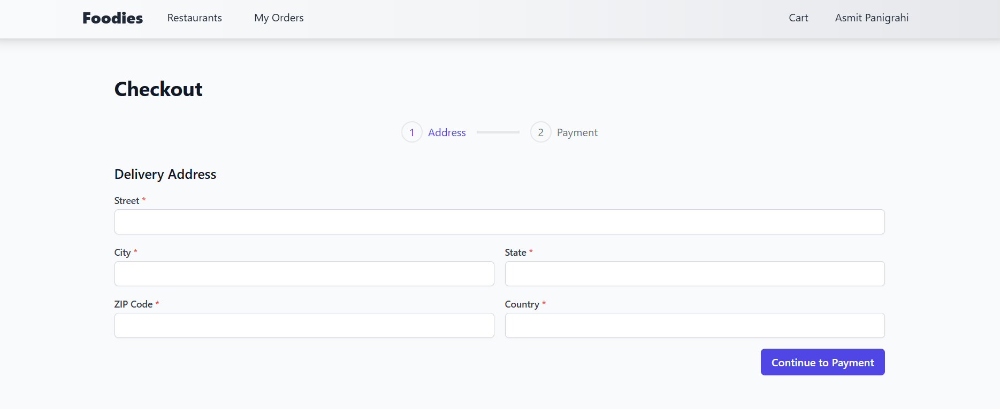
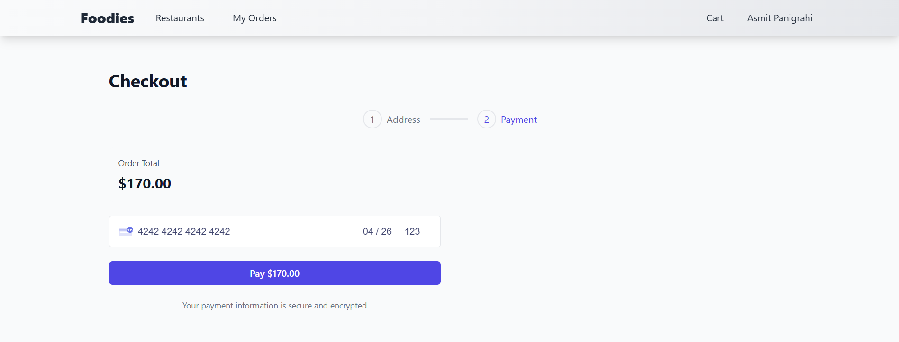
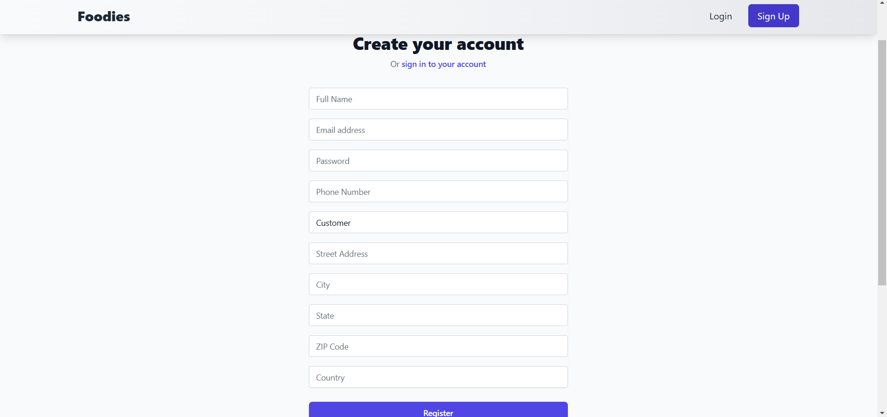
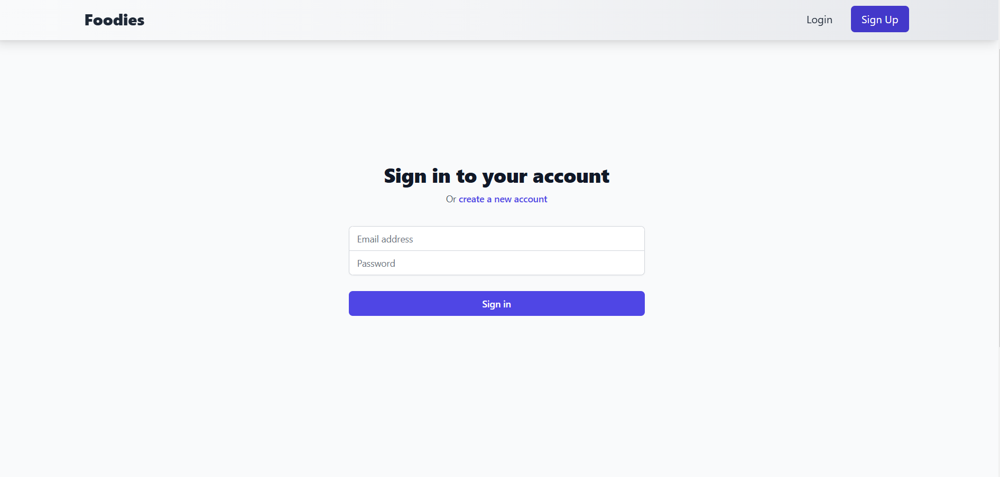

# 🍔 Foodies - Full Stack Food Delivery Platform


A modern MERN-stack food delivery platform that allows users to browse restaurants, order food online, make secure payments, and manage orders efficiently. The platform also provides restaurant owners with dedicated dashboards for managing menus, orders, and restaurant information.

---

## 📌 Overview

Foodies is a full-stack food delivery application built using the MERN Stack (MongoDB, Express.js, React.js, and Node.js). It provides a seamless experience for customers to discover restaurants, explore menus, place orders, and complete payments securely.

Restaurant owners can manage their restaurants through dedicated dashboards, update menu items, track orders, and monitor their business operations.

The application focuses on performance, scalability, security, and responsive design to deliver a smooth user experience across devices.

---

## ✨ Features

### 👤 Customer Features

- User Registration & Login
- Secure JWT Authentication
- Browse Restaurants
- Search Food Items
- Filter Menu by Categories
- View Restaurant Details
- View Menu Item Details
- Add Items to Cart
- Manage Shopping Cart
- Secure Checkout Process
- Stripe Payment Integration
- View Order History
- Responsive Design

### 🏪 Restaurant Owner Features

- Restaurant Owner Dashboard
- Restaurant Profile Management
- Menu Item Management
- Add New Food Items
- Update Existing Menu Items
- Delete Menu Items
- Upload Food Images
- Order Management System
- View Customer Orders

### 🔒 Security Features

- JWT Authentication
- Password Hashing with bcryptjs
- Secure HTTP Headers using Helmet
- Input Validation
- Protected Routes
- Environment Variable Protection
- CORS Configuration

---

## 🛠️ Tech Stack

### Frontend

- React.js
- React Router DOM
- Axios
- Tailwind CSS
- React Hot Toast
- React Icons

### Backend

- Node.js
- Express.js
- MongoDB
- Mongoose
- JSON Web Token (JWT)
- bcryptjs
- Cloudinary
- Stripe
- Helmet
- CORS
- Morgan
- Multer
- Compression
- dotenv

---

## 🏗️ System Architecture

```text
Frontend (React + Tailwind CSS)
            │
            ▼
      Express.js API
            │
 ┌──────────┴──────────┐
 ▼                     ▼
MongoDB          Cloudinary
(Database)      (Image Storage)
            │
            ▼
          Stripe
   (Payment Processing)
```

---

## Website Images

### All Restaurants

Description: A page displaying all registered restaurants.

### Cart

Description: The shopping cart page where users can view selected items.

### Checkout

Description: The checkout page for finalizing purchases.

### Customer Orders Page

Description: A page displaying customer orders.

### Filter by Category

Description: Allows users to filter menu items by category.

### Item Details Owner

Description: Detailed view of an item for the owner.

### Menu Item Details

Description: Detailed view of menu items.

### New Owner

Description: Interface for adding a new restaurant owner.

### Order Management

Description: Page for managing orders.

### Payment

Description: Payment processing interface.

### Register

Description: Registration page for new users.

### Restaurant Owner Menu Management

Description: Management interface for restaurant owners.

### Restaurant Owner Dashboard

Description: Dashboard for restaurant owners to manage their information.

### Restaurant Page

Description: Page displaying details of a specific restaurant.

### Restaurant Profile

Description: Profile page for a restaurant.

### Home Page

Description: The main landing page of the website.

### Login

Description: User login page.


## 📂 Project Structure

```bash
Foodies/
│
├── frontend/
│   ├── public/
│   ├── src/
│   ├── package.json
│   └── vite.config.js
│
├── backend/
│   ├── src/
│   │   ├── controllers/
│   │   ├── models/
│   │   ├── routes/
│   │   ├── middleware/
│   │   ├── utils/
│   │   └── config/
│   │
│   ├── server.js
│   └── package.json
│
├── Images/
├── Presentation/
└── README.md
```

---

## ⚙️ Installation

### Prerequisites

Before running the project, make sure you have:

- Node.js (v18 or higher)
- MongoDB
- Cloudinary Account
- Stripe Account

---

### Clone Repository

```bash
git clone https://github.com/dwipdarpon20/foodies.git
cd foodies
```

---

## Frontend Setup

Navigate to frontend:

```bash
cd frontend
```

Install dependencies:

```bash
npm install
```

Create a `.env` file:

```env
VITE_API_URL=
VITE_STRIPE_PUBLISHABLE_KEY=
```

Start frontend server:

```bash
npm run dev
```

---

## Backend Setup

Navigate to backend:

```bash
cd backend
```

Install dependencies:

```bash
npm install
```

Create a `.env` file:

```env
PORT=5000

MONGO_URI=

JWT_SECRET=

CLOUDINARY_CLOUD_NAME=
CLOUDINARY_API_KEY=
CLOUDINARY_API_SECRET=

STRIPE_SECRET_KEY=

FRONTEND_URL=
```

Start backend server:

```bash
npm run dev
```

---

## 🚀 Usage

After starting both frontend and backend servers:

```text
Frontend: http://localhost:5173
Backend : http://localhost:5000
```

1. Register a new account.
2. Browse restaurants.
3. Add food items to cart.
4. Complete checkout.
5. Make payment using Stripe.
6. Track your orders.
7. Restaurant owners can manage menus and orders from their dashboard.

---

## 🌐 Deployment

### Frontend

- Vercel

### Backend

- Render

> Note: Render free-tier services may take 30–60 seconds to wake up after inactivity.

---

## 🎯 Future Improvements

- Real-Time Order Tracking
- Google Authentication
- Push Notifications
- AI-Based Food Recommendations
- Admin Dashboard
- Coupon & Discount System
- Restaurant Analytics Dashboard
- Multi-Vendor Support

---

## 👨‍💻 Author

### Dwip Darpon Sarker

Computer Science & Engineering Student at NIT Rourkela

Passionate about Full Stack Development, Backend Engineering, System Design, and Building Scalable Web Applications.

### Connect With Me

- GitHub: https://github.com/dwipdarpon20
- LinkedIn: https://linkedin.com/in/dwipdarpon
- Email: dwipdarpon20@gmail.com

---

## 📄 License

This project is developed for educational, learning, and portfolio purposes.

Feel free to fork, modify, and improve the project.

---

⭐ If you found this project helpful, consider giving it a star on GitHub!
